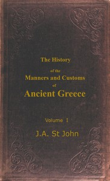

# The History of the Manners and Customs of Ancient Greece, Volume 1 (of 3) <kbd>67552</kbd>

## Authors

 - St. John, James Augustus <small>(1795 - 1875)</small>

## Subjects

 - Greece -- Social life and customs

## Download

 - https://www.gutenberg.org/ebooks/67552.rdf
 - https://www.gutenberg.org/ebooks/67552.epub.images
 - https://www.gutenberg.org/cache/epub/67552/pg67552.cover.small.jpg
 - https://www.gutenberg.org/ebooks/67552.html.images
 - https://www.gutenberg.org/ebooks/67552.kindle.images
 - https://www.gutenberg.org/ebooks/67552.txt.utf-8
 - https://www.gutenberg.org/files/67552/67552-h.zip
 - https://www.gutenberg.org/files/67552/67552-0.txt

## Book Shelves

