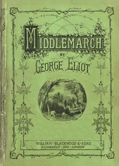

# Middlemarch <kbd>145</kbd>

## Authors

 - Eliot, George <small>(1819 - 1880)</small>

## Subjects

 - Bildungsromans
 - City and town life -- Fiction
 - Didactic fiction
 - Domestic fiction
 - England -- Fiction
 - Love stories
 - Married people -- Fiction
 - Young women -- Fiction

## Download

 - https://www.gutenberg.org/files/145/145-h.zip
 - https://www.gutenberg.org/files/145/145-0.zip
 - https://www.gutenberg.org/cache/epub/145/pg145.cover.small.jpg
 - https://www.gutenberg.org/files/145/145-h/145-h.htm
 - https://www.gutenberg.org/ebooks/145.html.images
 - https://www.gutenberg.org/ebooks/145.kindle.images
 - https://www.gutenberg.org/ebooks/145.rdf
 - https://www.gutenberg.org/ebooks/145.epub.images

## Book Shelves

 - Best Books Ever Listings
 - Historical Fiction
