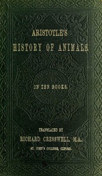

# Aristotle's History of Animals: In Ten Books <kbd>59058</kbd>

## Authors

 - Aristotle <small>(-384 - -322)</small>

## Subjects

 - Zoology -- Pre-Linnaean works

## Download

 - https://www.gutenberg.org/files/59058/59058-h.zip
 - https://www.gutenberg.org/files/59058/59058-0.zip
 - https://www.gutenberg.org/cache/epub/59058/pg59058.cover.small.jpg
 - https://www.gutenberg.org/ebooks/59058.html.images
 - https://www.gutenberg.org/ebooks/59058.epub.images
 - https://www.gutenberg.org/ebooks/59058.rdf
 - https://www.gutenberg.org/ebooks/59058.kindle.images

## Book Shelves

