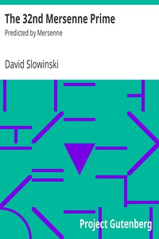

# The 32nd Mersenne Prime: Predicted by Mersenne <kbd>69</kbd>

## Authors

 - Slowinski, David <small>(null - null)</small>

## Subjects

 - Number theory
 - Numbers, Prime

## Download

 - https://www.gutenberg.org/cache/epub/69/pg69.cover.small.jpg
 - https://www.gutenberg.org/files/69/69.txt
 - https://www.gutenberg.org/ebooks/69.kindle.images
 - https://www.gutenberg.org/ebooks/69.txt.utf-8
 - https://www.gutenberg.org/ebooks/69.html.images
 - https://www.gutenberg.org/ebooks/69.rdf
 - https://www.gutenberg.org/ebooks/69.epub.images

## Book Shelves

 - Mathematics
