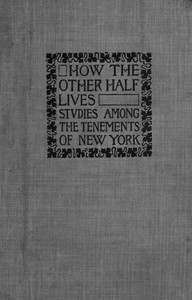

# How the Other Half Lives: Studies Among the Tenements of New York <kbd>45502</kbd>

## Authors

 - Riis, Jacob A. (Jacob August) <small>(1849 - 1914)</small>

## Subjects

 - Poor -- New York (State) -- New York
 - Tenement houses -- New York (State) -- New York

## Download

 - https://www.gutenberg.org/files/45502/45502-h.zip
 - https://www.gutenberg.org/files/45502/45502.zip
 - https://www.gutenberg.org/files/45502/45502.txt
 - https://www.gutenberg.org/files/45502/45502-8.txt
 - https://www.gutenberg.org/cache/epub/45502/pg45502.cover.small.jpg
 - https://www.gutenberg.org/ebooks/45502.html.images
 - https://www.gutenberg.org/ebooks/45502.kindle.images
 - https://www.gutenberg.org/ebooks/45502.rdf
 - https://www.gutenberg.org/ebooks/45502.epub.images
 - https://www.gutenberg.org/ebooks/45502.txt.utf-8

## Book Shelves

