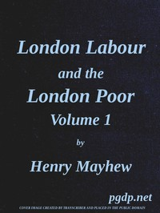

# London Labour and the London Poor, Vol. 1 <kbd>55998</kbd>

## Authors

 - Mayhew, Henry <small>(1812 - 1887)</small>

## Subjects

 - Charities -- England -- London
 - Criminals -- England -- London
 - London (England) -- Social conditions
 - Poor -- England -- London
 - Prostitution -- England -- London
 - Unemployed -- England -- London
 - Working class -- England -- London

## Download

 - https://www.gutenberg.org/cache/epub/55998/pg55998.cover.small.jpg
 - https://www.gutenberg.org/files/55998/55998-h.zip
 - https://www.gutenberg.org/files/55998/55998-h/55998-h.htm
 - https://www.gutenberg.org/ebooks/55998.html.images
 - https://www.gutenberg.org/files/55998/55998-0.txt
 - https://www.gutenberg.org/ebooks/55998.rdf
 - https://www.gutenberg.org/ebooks/55998.epub.images
 - https://www.gutenberg.org/ebooks/55998.kindle.images

## Book Shelves

