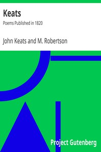

# Keats: Poems Published in 1820 <kbd>23684</kbd>

## Authors

 - Keats, John <small>(1795 - 1821)</small>

## Subjects

 - English poetry -- 19th century

## Download

 - https://www.gutenberg.org/files/23684/23684.zip
 - https://www.gutenberg.org/files/23684/23684-8.zip
 - https://www.gutenberg.org/files/23684/23684.txt
 - https://www.gutenberg.org/ebooks/23684.html.images
 - https://www.gutenberg.org/cache/epub/23684/pg23684.cover.small.jpg
 - https://www.gutenberg.org/files/23684/23684-h/23684-h.htm
 - https://www.gutenberg.org/ebooks/23684.kindle.images
 - https://www.gutenberg.org/ebooks/23684.rdf
 - https://www.gutenberg.org/ebooks/23684.epub.images
 - https://www.gutenberg.org/ebooks/23684.txt.utf-8

## Book Shelves

 - Poetry
