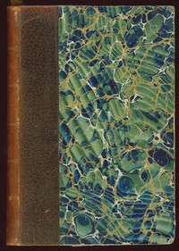

# Les Misérables <kbd>135</kbd>

## Authors

 - Hugo, Victor <small>(1802 - 1885)</small>

## Subjects

 - Epic literature
 - Ex-convicts -- Fiction
 - Historical fiction
 - Orphans -- Fiction
 - Paris (France) -- Fiction

## Download

 - https://www.gutenberg.org/files/135/135-0.zip
 - https://www.gutenberg.org/files/135/135-h.zip
 - https://www.gutenberg.org/cache/epub/135/pg135.cover.small.jpg
 - https://www.gutenberg.org/files/135/135-h/135-h.htm
 - https://www.gutenberg.org/ebooks/135.html.images
 - https://www.gutenberg.org/ebooks/135.kindle.images
 - https://www.gutenberg.org/ebooks/135.rdf
 - https://www.gutenberg.org/ebooks/135.epub.images

## Book Shelves

 - Banned Books from Anne Haight's list
 - Historical Fiction
