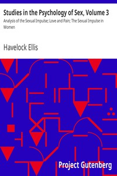

# Studies in the Psychology of Sex, Volume 3: Analysis of the Sexual Impulse; Love and Pain; The Sexual Impulse in Women <kbd>13612</kbd>

## Authors

 - Ellis, Havelock <small>(1859 - 1939)</small>

## Subjects

 - Sex
 - Sex (Psychology)

## Download

 - https://www.gutenberg.org/files/13612/13612.zip
 - https://www.gutenberg.org/files/13612/13612-h/13612-h.htm
 - https://www.gutenberg.org/cache/epub/13612/pg13612.cover.medium.jpg
 - https://www.gutenberg.org/files/13612/13612-8.zip
 - https://www.gutenberg.org/ebooks/13612.html.images
 - https://www.gutenberg.org/files/13612/13612-8.txt
 - https://www.gutenberg.org/ebooks/13612.txt.utf-8
 - https://www.gutenberg.org/ebooks/13612.kindle.images
 - https://www.gutenberg.org/ebooks/13612.epub.images
 - https://www.gutenberg.org/ebooks/13612.rdf

## Book Shelves

 - Banned Books from Anne Haight's list
 - Psychology
