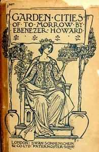

# Garden Cities of To-Morrow: Being the Second Edition of "To-Morrow: a Peaceful Path to Real Reform" <kbd>46134</kbd>

## Authors

 - Howard, Ebenezer, Sir <small>(1850 - 1928)</small>

## Subjects

 - Garden cities

## Download

 - https://www.gutenberg.org/files/46134/46134.zip
 - https://www.gutenberg.org/cache/epub/46134/pg46134.cover.medium.jpg
 - https://www.gutenberg.org/files/46134/46134-0.zip
 - https://www.gutenberg.org/files/46134/46134-8.txt
 - https://www.gutenberg.org/files/46134/46134.txt
 - https://www.gutenberg.org/files/46134/46134-h.zip
 - https://www.gutenberg.org/ebooks/46134.html.images
 - https://www.gutenberg.org/ebooks/46134.kindle.images
 - https://www.gutenberg.org/ebooks/46134.rdf
 - https://www.gutenberg.org/ebooks/46134.epub.images

## Book Shelves

