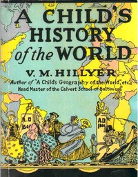

# A Child's History of the World <kbd>67149</kbd>

## Authors

 - Hillyer, V. M. (Virgil Mores) <small>(1875 - 1931)</small>

## Subjects

 - World history -- Juvenile literature

## Download

 - https://www.gutenberg.org/cache/epub/67149/pg67149.cover.small.jpg
 - https://www.gutenberg.org/files/67149/67149-h.zip
 - https://www.gutenberg.org/files/67149/67149-h/67149-h.htm
 - https://www.gutenberg.org/ebooks/67149.rdf
 - https://www.gutenberg.org/ebooks/67149.txt.utf-8
 - https://www.gutenberg.org/ebooks/67149.kindle.images
 - https://www.gutenberg.org/ebooks/67149.epub.images
 - https://www.gutenberg.org/files/67149/67149-0.txt

## Book Shelves

