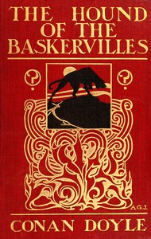

# The Hound of the Baskervilles <kbd>2852</kbd>

## Authors

 - Doyle, Arthur Conan <small>(1859 - 1930)</small>

## Subjects

 - Blessing and cursing -- Fiction
 - Dartmoor (England) -- Fiction
 - Detective and mystery stories
 - Dogs -- Fiction
 - Holmes, Sherlock (Fictitious character) -- Fiction
 - Private investigators -- England -- Fiction

## Download

 - https://www.gutenberg.org/cache/epub/2852/pg2852.cover.small.jpg
 - https://www.gutenberg.org/files/2852/2852-0.zip
 - https://www.gutenberg.org/files/2852/2852-h/2852-h.htm
 - https://www.gutenberg.org/ebooks/2852.html.images
 - https://www.gutenberg.org/ebooks/2852.rdf
 - https://www.gutenberg.org/ebooks/2852.epub.images
 - https://www.gutenberg.org/ebooks/2852.kindle.images

## Book Shelves

 - Bestsellers, American, 1895-1923
 - Detective Fiction
