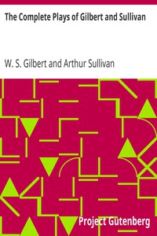

# The Complete Plays of Gilbert and Sullivan <kbd>808</kbd>

## Authors

 - Gilbert, W. S. (William Schwenck) <small>(1836 - 1911)</small>
 - Sullivan, Arthur <small>(1842 - 1900)</small>

## Subjects

 - Operas -- Librettos

## Download

 - https://www.gutenberg.org/files/808/808.zip
 - https://www.gutenberg.org/files/808/808-h.zip
 - https://www.gutenberg.org/files/808/808-h/808-h.htm
 - https://www.gutenberg.org/cache/epub/808/pg808.cover.medium.jpg
 - https://www.gutenberg.org/ebooks/808.html.images
 - https://www.gutenberg.org/ebooks/808.kindle.images
 - https://www.gutenberg.org/ebooks/808.txt.utf-8
 - https://www.gutenberg.org/ebooks/808.rdf
 - https://www.gutenberg.org/ebooks/808.epub.images

## Book Shelves

 - Banned Books from Anne Haight's list
 - Opera
