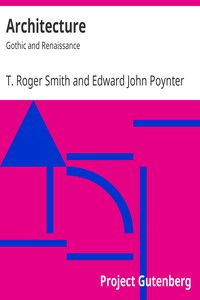

# Architecture: Gothic and Renaissance <kbd>33837</kbd>

## Authors

 - Smith, T. Roger (Thomas Roger) <small>(1830 - 1903)</small>

## Subjects

 - Architecture -- History
 - Architecture, Gothic
 - Architecture, Renaissance
 - Church architecture

## Download

 - https://www.gutenberg.org/cache/epub/33837/pg33837.cover.small.jpg
 - https://www.gutenberg.org/files/33837/33837.zip
 - https://www.gutenberg.org/files/33837/33837-8.zip
 - https://www.gutenberg.org/files/33837/33837.txt
 - https://www.gutenberg.org/ebooks/33837.html.images
 - https://www.gutenberg.org/files/33837/33837-h/33837-h.htm
 - https://www.gutenberg.org/ebooks/33837.kindle.images
 - https://www.gutenberg.org/ebooks/33837.txt.utf-8
 - https://www.gutenberg.org/ebooks/33837.epub.images
 - https://www.gutenberg.org/ebooks/33837.rdf

## Book Shelves

