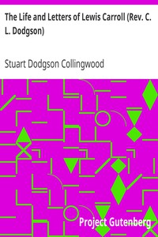

# The Life and Letters of Lewis Carroll (Rev. C. L. Dodgson) <kbd>11483</kbd>

## Authors

 - Collingwood, Stuart Dodgson <small>(1870 - 1937)</small>

## Subjects

 - Authors, English -- 19th century -- Biography
 - Carroll, Lewis, 1832-1898
 - Children -- Books and reading -- Great Britain -- History -- 19th century
 - Children's literature -- Authorship
 - Fantasy literature -- Authorship
 - Mathematicians -- Great Britain -- Biography
 - Mathematics teachers -- Great Britain -- Biography
 - Oxford (England) -- Biography
 - Photographers -- Great Britain -- Biography

## Download

 - https://www.gutenberg.org/files/11483/11483-8.zip
 - https://www.gutenberg.org/files/11483/11483.txt
 - https://www.gutenberg.org/files/11483/11483-h.zip
 - https://www.gutenberg.org/cache/epub/11483/pg11483.cover.small.jpg
 - https://www.gutenberg.org/ebooks/11483.html.images
 - https://www.gutenberg.org/files/11483/11483-8.txt
 - https://www.gutenberg.org/ebooks/11483.txt.utf-8
 - https://www.gutenberg.org/ebooks/11483.epub.images
 - https://www.gutenberg.org/ebooks/11483.rdf
 - https://www.gutenberg.org/ebooks/11483.kindle.images

## Book Shelves

