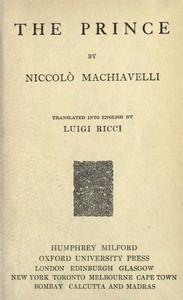

# The Prince <kbd>57037</kbd>

## Authors

 - Machiavelli, Niccolò <small>(1469 - 1527)</small>

## Subjects

 - Political ethics -- Early works to 1800
 - Political science -- Philosophy -- Early works to 1800
 - State, The -- Early works to 1800

## Download

 - https://www.gutenberg.org/files/57037/57037-h/57037-h.htm
 - https://www.gutenberg.org/cache/epub/57037/pg57037.cover.small.jpg
 - https://www.gutenberg.org/files/57037/57037-0.txt
 - https://www.gutenberg.org/files/57037/57037-0.zip
 - https://www.gutenberg.org/ebooks/57037.html.images
 - https://www.gutenberg.org/ebooks/57037.rdf
 - https://www.gutenberg.org/ebooks/57037.epub.images
 - https://www.gutenberg.org/ebooks/57037.kindle.images

## Book Shelves

