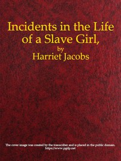

# Incidents in the Life of a Slave Girl, Written by Herself <kbd>11030</kbd>

## Authors

 - Jacobs, Harriet A. (Harriet Ann) <small>(1813 - 1897)</small>

## Subjects

 - Jacobs, Harriet A. (Harriet Ann), 1813-1897
 - Slaves -- United States -- Biography
 - Slaves -- United States -- Social conditions
 - Women slaves -- United States -- Biography

## Download

 - https://www.gutenberg.org/files/11030/11030-h.zip
 - https://www.gutenberg.org/cache/epub/11030/pg11030.cover.medium.jpg
 - https://www.gutenberg.org/ebooks/11030.html.images
 - https://www.gutenberg.org/ebooks/11030.txt.utf-8
 - https://www.gutenberg.org/files/11030/11030-0.txt
 - https://www.gutenberg.org/ebooks/11030.epub.images
 - https://www.gutenberg.org/ebooks/11030.rdf
 - https://www.gutenberg.org/ebooks/11030.kindle.images

## Book Shelves

 - African American Writers
