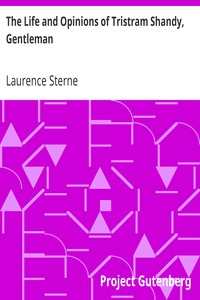

# The Life and Opinions of Tristram Shandy, Gentleman <kbd>39270</kbd>

## Authors

 - Sterne, Laurence <small>(1713 - 1768)</small>

## Subjects

 - Experimental fiction
 - Fetus -- Fiction
 - Fiction -- Authorship -- Fiction
 - Infants -- Fiction
 - Stream of consciousness fiction

## Download

 - https://www.gutenberg.org/ebooks/39270.html.images
 - https://www.gutenberg.org/cache/epub/39270/pg39270.cover.small.jpg
 - https://www.gutenberg.org/files/39270/39270-h.zip
 - https://www.gutenberg.org/ebooks/39270.txt.utf-8
 - https://www.gutenberg.org/files/39270/39270-0.txt
 - https://www.gutenberg.org/ebooks/39270.rdf
 - https://www.gutenberg.org/ebooks/39270.kindle.images
 - https://www.gutenberg.org/ebooks/39270.epub.images

## Book Shelves

