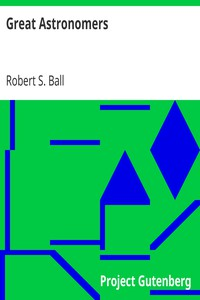

# Great Astronomers <kbd>2298</kbd>

## Authors

 - Ball, Robert S. (Robert Stawell) <small>(1840 - 1913)</small>

## Subjects

 - Astronomers
 - Astronomy -- History

## Download

 - https://www.gutenberg.org/files/2298/2298.zip
 - https://www.gutenberg.org/cache/epub/2298/pg2298.cover.medium.jpg
 - https://www.gutenberg.org/files/2298/2298.txt
 - https://www.gutenberg.org/files/2298/2298-h/2298-h.htm
 - https://www.gutenberg.org/ebooks/2298.html.images
 - https://www.gutenberg.org/ebooks/2298.rdf
 - https://www.gutenberg.org/ebooks/2298.epub.images
 - https://www.gutenberg.org/ebooks/2298.kindle.images
 - https://www.gutenberg.org/ebooks/2298.txt.utf-8

## Book Shelves

