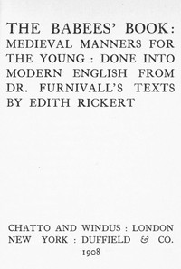

# The Babees' Book: Medieval Manners for the Young: Done into Modern English <kbd>58985</kbd>

## Authors

## Subjects

 - Child rearing
 - Children -- Conduct of life
 - Conduct of life
 - Education
 - Education -- England
 - England -- Social life and customs
 - Etiquette for children and teenagers
 - Etiquette, Medieval
 - Home economics -- England
 - Table

## Download

 - https://www.gutenberg.org/files/58985/58985-h.zip
 - https://www.gutenberg.org/files/58985/58985-0.zip
 - https://www.gutenberg.org/cache/epub/58985/pg58985.cover.medium.jpg
 - https://www.gutenberg.org/ebooks/58985.html.images
 - https://www.gutenberg.org/ebooks/58985.rdf
 - https://www.gutenberg.org/ebooks/58985.epub.images
 - https://www.gutenberg.org/ebooks/58985.kindle.images

## Book Shelves

