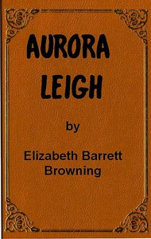

# Aurora Leigh <kbd>56621</kbd>

## Authors

 - Browning, Elizabeth Barrett <small>(1806 - 1861)</small>

## Subjects

 - English poetry -- 19th century
 - Epic poetry, English
 - Novels in verse

## Download

 - https://www.gutenberg.org/files/56621/56621-0.zip
 - https://www.gutenberg.org/cache/epub/56621/pg56621.cover.small.jpg
 - https://www.gutenberg.org/files/56621/56621-h/56621-h.htm
 - https://www.gutenberg.org/ebooks/56621.txt.utf-8
 - https://www.gutenberg.org/files/56621/56621-0.txt
 - https://www.gutenberg.org/ebooks/56621.epub.images
 - https://www.gutenberg.org/ebooks/56621.rdf
 - https://www.gutenberg.org/ebooks/56621.kindle.images

## Book Shelves

