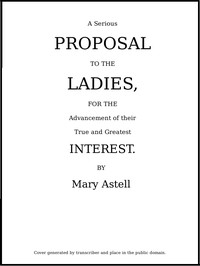

# A serious proposal to the Ladies, for the advancement of their true and greatest interest (In Two Parts) <kbd>54984</kbd>

## Authors

 - Astell, Mary <small>(1666 - 1731)</small>

## Subjects

 - Feminism -- Great Britain -- History -- 18th century -- Sources
 - Women's rights -- Great Britain -- History -- 18th century -- Sources

## Download

 - https://www.gutenberg.org/files/54984/54984-0.zip
 - https://www.gutenberg.org/files/54984/54984-h.zip
 - https://www.gutenberg.org/cache/epub/54984/pg54984.cover.small.jpg
 - https://www.gutenberg.org/files/54984/54984-0.txt
 - https://www.gutenberg.org/ebooks/54984.html.images
 - https://www.gutenberg.org/ebooks/54984.rdf
 - https://www.gutenberg.org/ebooks/54984.kindle.images
 - https://www.gutenberg.org/ebooks/54984.epub.images

## Book Shelves

