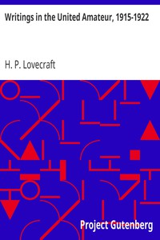

# Writings in the United Amateur, 1915-1922 <kbd>30637</kbd>

## Authors

 - Lovecraft, H. P. (Howard Phillips) <small>(1890 - 1937)</small>

## Subjects

 - Essays
 - Literature -- History and criticism
 - Periodicals

## Download

 - https://www.gutenberg.org/files/30637/30637-h/30637-h.htm
 - https://www.gutenberg.org/files/30637/30637-h.zip
 - https://www.gutenberg.org/cache/epub/30637/pg30637.cover.small.jpg
 - https://www.gutenberg.org/ebooks/30637.txt.utf-8
 - https://www.gutenberg.org/files/30637/30637-0.zip
 - https://www.gutenberg.org/files/30637/30637-0.txt
 - https://www.gutenberg.org/ebooks/30637.epub.images
 - https://www.gutenberg.org/ebooks/30637.rdf
 - https://www.gutenberg.org/ebooks/30637.kindle.images

## Book Shelves

 - Science Fiction
