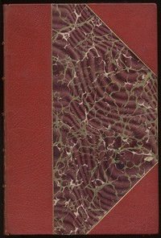

# Waverley; Or, 'Tis Sixty Years Since <kbd>5998</kbd>

## Authors

 - Scott, Walter <small>(1771 - 1832)</small>

## Subjects

 - Historical fiction
 - Jacobite Rebellion, 1745-1746 -- Fiction

## Download

 - https://www.gutenberg.org/cache/epub/5998/pg5998.cover.medium.jpg
 - https://www.gutenberg.org/files/5998/5998-h.zip
 - https://www.gutenberg.org/files/5998/5998-h/5998-h.htm
 - https://www.gutenberg.org/ebooks/5998.txt.utf-8
 - https://www.gutenberg.org/files/5998/5998-0.txt
 - https://www.gutenberg.org/ebooks/5998.kindle.images
 - https://www.gutenberg.org/ebooks/5998.rdf
 - https://www.gutenberg.org/ebooks/5998.epub.images

## Book Shelves

 - Historical Fiction
