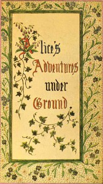

# Alice's Adventures Under Ground: Being a facsimile of the original Ms. book afterwards developed into "Alice's Adventures in Wonderland" <kbd>19002</kbd>

## Authors

 - Carroll, Lewis <small>(1832 - 1898)</small>

## Subjects

 - Alice (Fictitious character from Carroll) -- Juvenile fiction
 - Children's stories
 - Fantasy fiction
 - Imaginary places -- Juvenile fiction

## Download

 - https://www.gutenberg.org/files/19002/19002-h.zip
 - https://www.gutenberg.org/cache/epub/19002/pg19002.cover.medium.jpg
 - https://www.gutenberg.org/files/19002/19002-0.zip
 - https://www.gutenberg.org/files/19002/19002-h/19002-h.htm
 - https://www.gutenberg.org/ebooks/19002.html.images
 - https://www.gutenberg.org/ebooks/19002.kindle.images
 - https://www.gutenberg.org/ebooks/19002.epub.images
 - https://www.gutenberg.org/ebooks/19002.rdf

## Book Shelves

 - Children's Literature
