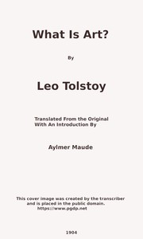

# What Is Art? <kbd>64908</kbd>

## Authors

 - Tolstoy, Leo, graf <small>(1828 - 1910)</small>

## Subjects

 - Arts -- Philosophy
 - Arts and morals

## Download

 - https://www.gutenberg.org/cache/epub/64908/pg64908.cover.medium.jpg
 - https://www.gutenberg.org/files/64908/64908-0.zip
 - https://www.gutenberg.org/files/64908/64908-0.txt
 - https://www.gutenberg.org/ebooks/64908.html.images
 - https://www.gutenberg.org/files/64908/64908-h/64908-h.htm
 - https://www.gutenberg.org/ebooks/64908.rdf
 - https://www.gutenberg.org/ebooks/64908.kindle.images
 - https://www.gutenberg.org/ebooks/64908.epub.images

## Book Shelves

