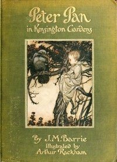

# Peter Pan in Kensington Gardens <kbd>26998</kbd>

## Authors

 - Barrie, J. M. (James Matthew) <small>(1860 - 1937)</small>

## Subjects

 - Fairies -- Fiction
 - Fantasy literature
 - Kensington Gardens (London, England) -- Fiction
 - Peter Pan (Fictitious character) -- Fiction

## Download

 - https://www.gutenberg.org/files/26998/26998.zip
 - https://www.gutenberg.org/files/26998/26998.txt
 - https://www.gutenberg.org/files/26998/26998-h/26998-h.htm
 - https://www.gutenberg.org/cache/epub/26998/pg26998.cover.medium.jpg
 - https://www.gutenberg.org/ebooks/26998.html.images
 - https://www.gutenberg.org/ebooks/26998.rdf
 - https://www.gutenberg.org/ebooks/26998.kindle.images
 - https://www.gutenberg.org/ebooks/26998.epub.images
 - https://www.gutenberg.org/ebooks/26998.txt.utf-8

## Book Shelves

