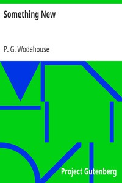

# Something New <kbd>2042</kbd>

## Authors

 - Wodehouse, P. G. (Pelham Grenville) <small>(1881 - 1975)</small>

## Subjects

 - Blandings Castle (England : Imaginary place) -- Fiction
 - Humorous stories
 - Nobility -- Fiction
 - Shropshire (England) -- Fiction

## Download

 - https://www.gutenberg.org/files/2042/2042.zip
 - https://www.gutenberg.org/cache/epub/2042/pg2042.cover.medium.jpg
 - https://www.gutenberg.org/ebooks/2042.rdf
 - https://www.gutenberg.org/ebooks/2042.epub.images
 - https://www.gutenberg.org/ebooks/2042.kindle.images
 - https://www.gutenberg.org/ebooks/2042.html.images
 - https://www.gutenberg.org/ebooks/2042.txt.utf-8

## Book Shelves

 - Best Books Ever Listings
 - Humor
