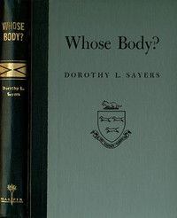

# Whose Body? A Lord Peter Wimsey Novel <kbd>58820</kbd>

## Authors

 - Sayers, Dorothy L. (Dorothy Leigh) <small>(1893 - 1957)</small>

## Subjects

 - Detective and mystery stories
 - Murder -- Investigation -- Fiction
 - Private investigators -- England -- Fiction
 - Wimsey, Peter, Lord (Fictitious character), 1890- -- Fiction

## Download

 - https://www.gutenberg.org/files/58820/58820-0.zip
 - https://www.gutenberg.org/cache/epub/58820/pg58820.cover.small.jpg
 - https://www.gutenberg.org/files/58820/58820-h.zip
 - https://www.gutenberg.org/files/58820/58820-0.txt
 - https://www.gutenberg.org/ebooks/58820.html.images
 - https://www.gutenberg.org/ebooks/58820.rdf
 - https://www.gutenberg.org/ebooks/58820.epub.images
 - https://www.gutenberg.org/ebooks/58820.kindle.images

## Book Shelves

 - Detective Fiction
