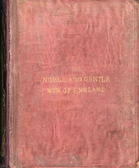

# The Noble and Gentle Men of England: or, notes touching the arms and descents of the ancient knightly and gentle houses of England, arranged in their respective counties. <kbd>58212</kbd>

## Authors

 - Shirley, Evelyn Philip <small>(1812 - 1882)</small>

## Subjects

 - Great Britain -- Genealogy
 - Heraldry -- Great Britain
 - Nobility -- Great Britain

## Download

 - https://www.gutenberg.org/cache/epub/58212/pg58212.cover.medium.jpg
 - https://www.gutenberg.org/files/58212/58212-h/58212-h.htm
 - https://www.gutenberg.org/files/58212/58212-h.zip
 - https://www.gutenberg.org/ebooks/58212.html.images
 - https://www.gutenberg.org/files/58212/58212-8.txt
 - https://www.gutenberg.org/ebooks/58212.txt.utf-8
 - https://www.gutenberg.org/ebooks/58212.rdf
 - https://www.gutenberg.org/ebooks/58212.kindle.images
 - https://www.gutenberg.org/ebooks/58212.epub.images

## Book Shelves

