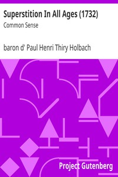

# Superstition In All Ages (1732): Common Sense <kbd>17607</kbd>

## Authors

 - Holbach, Paul Henri Thiry, baron d' <small>(1723 - 1789)</small>

## Subjects

 - Atheism

## Download

 - https://www.gutenberg.org/files/17607/17607-h.zip
 - https://www.gutenberg.org/files/17607/17607-8.txt
 - https://www.gutenberg.org/files/17607/17607.zip
 - https://www.gutenberg.org/cache/epub/17607/pg17607.cover.small.jpg
 - https://www.gutenberg.org/ebooks/17607.html.images
 - https://www.gutenberg.org/ebooks/17607.txt.utf-8
 - https://www.gutenberg.org/ebooks/17607.kindle.images
 - https://www.gutenberg.org/ebooks/17607.epub.images
 - https://www.gutenberg.org/ebooks/17607.rdf

## Book Shelves

 - Atheism
