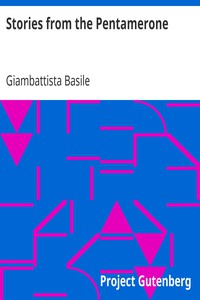

# Stories from the Pentamerone <kbd>2198</kbd>

## Authors

 - Basile, Giambattista <small>(null - 1632)</small>

## Subjects

 - Folklore -- Italy

## Download

 - https://www.gutenberg.org/files/2198/2198.txt
 - https://www.gutenberg.org/cache/epub/2198/pg2198.cover.small.jpg
 - https://www.gutenberg.org/ebooks/2198.html.images
 - https://www.gutenberg.org/files/2198/2198-h/2198-h.htm
 - https://www.gutenberg.org/ebooks/2198.kindle.images
 - https://www.gutenberg.org/ebooks/2198.txt.utf-8
 - https://www.gutenberg.org/ebooks/2198.rdf
 - https://www.gutenberg.org/ebooks/2198.epub.images

## Book Shelves

