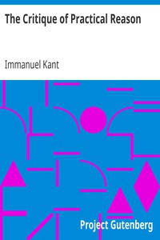

# The Critique of Practical Reason <kbd>5683</kbd>

## Authors

 - Kant, Immanuel <small>(1724 - 1804)</small>

## Subjects

 - Ethics
 - Philosophy, German
 - Practical reason

## Download

 - https://www.gutenberg.org/files/5683/5683.zip
 - https://www.gutenberg.org/cache/epub/5683/pg5683.cover.medium.jpg
 - https://www.gutenberg.org/files/5683/5683-h.zip
 - https://www.gutenberg.org/files/5683/5683-h/5683-h.htm
 - https://www.gutenberg.org/ebooks/5683.html.images
 - https://www.gutenberg.org/ebooks/5683.kindle.images
 - https://www.gutenberg.org/ebooks/5683.rdf
 - https://www.gutenberg.org/ebooks/5683.epub.images
 - https://www.gutenberg.org/ebooks/5683.txt.utf-8

## Book Shelves

 - Banned Books from Anne Haight's list
