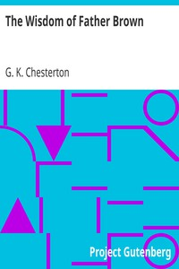

# The Wisdom of Father Brown <kbd>223</kbd>

## Authors

 - Chesterton, G. K. (Gilbert Keith) <small>(1874 - 1936)</small>

## Subjects

 - Brown, Father (Fictitious character) -- Fiction
 - Catholics -- Fiction
 - Clergy -- Fiction
 - Detective and mystery stories, English
 - England -- Fiction

## Download

 - https://www.gutenberg.org/files/223/223-h.zip
 - https://www.gutenberg.org/files/223/223.zip
 - https://www.gutenberg.org/cache/epub/223/pg223.cover.small.jpg
 - https://www.gutenberg.org/ebooks/223.html.images
 - https://www.gutenberg.org/files/223/223-0.txt
 - https://www.gutenberg.org/ebooks/223.kindle.images
 - https://www.gutenberg.org/ebooks/223.rdf
 - https://www.gutenberg.org/ebooks/223.epub.images

## Book Shelves

 - Detective Fiction
