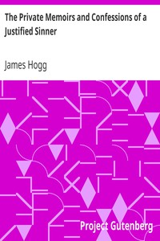

# The Private Memoirs and Confessions of a Justified Sinner <kbd>2276</kbd>

## Authors

 - Hogg, James <small>(1770 - 1835)</small>

## Subjects

 - Murderers -- Fiction
 - Psychological fiction
 - Scotland -- Fiction

## Download

 - https://www.gutenberg.org/files/2276/2276-h.zip
 - https://www.gutenberg.org/cache/epub/2276/pg2276.cover.small.jpg
 - https://www.gutenberg.org/files/2276/2276-h/2276-h.htm
 - https://www.gutenberg.org/files/2276/2276-0.txt
 - https://www.gutenberg.org/ebooks/2276.html.images
 - https://www.gutenberg.org/ebooks/2276.kindle.images
 - https://www.gutenberg.org/ebooks/2276.txt.utf-8
 - https://www.gutenberg.org/ebooks/2276.rdf
 - https://www.gutenberg.org/ebooks/2276.epub.images

## Book Shelves

 - Best Books Ever Listings
 - Gothic Fiction
