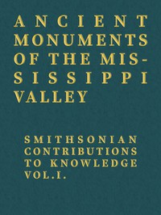

# Ancient Monuments of the Mississippi Valley: Smithsonian Contributions to Knowledge, Vol. I. <kbd>49668</kbd>

## Authors

 - Davis, E. H. (Edwin Hamilton) <small>(1811 - 1888)</small>
 - Squier, E. G. (Ephraim George) <small>(1821 - 1888)</small>

## Subjects

 - Indians of North America -- Mississippi River Valley -- Antiquities
 - Mississippi River Valley -- Antiquities
 - Mounds -- Mississippi River Valley
 - Ohio River Valley -- Antiquities

## Download

 - https://www.gutenberg.org/files/49668/49668-0.zip
 - https://www.gutenberg.org/cache/epub/49668/pg49668.cover.medium.jpg
 - https://www.gutenberg.org/ebooks/49668.html.images
 - https://www.gutenberg.org/files/49668/49668-h/49668-h.htm
 - https://www.gutenberg.org/ebooks/49668.rdf
 - https://www.gutenberg.org/ebooks/49668.epub.images
 - https://www.gutenberg.org/ebooks/49668.kindle.images

## Book Shelves

