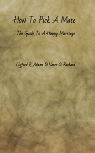

# How to Pick a Mate: The Guide to a Happy Marriage <kbd>67472</kbd>

## Authors

 - Adams, Clifford R. (Clifford Rose) <small>(1902 - 1987)</small>
 - Packard, Vance <small>(1914 - 1996)</small>

## Subjects

 - Marriage

## Download

 - https://www.gutenberg.org/files/67472/67472-h/67472-h.htm
 - https://www.gutenberg.org/ebooks/67472.rdf
 - https://www.gutenberg.org/ebooks/67472.txt.utf-8
 - https://www.gutenberg.org/ebooks/67472.kindle.images
 - https://www.gutenberg.org/cache/epub/67472/pg67472.cover.small.jpg
 - https://www.gutenberg.org/ebooks/67472.epub.images
 - https://www.gutenberg.org/files/67472/67472-0.txt
 - https://www.gutenberg.org/files/67472/67472-h.zip

## Book Shelves

