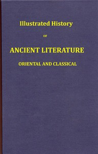

# Illustrated history of ancient literature, oriental and classical <kbd>67687</kbd>

## Authors

 - Quackenbos, John D. (John Duncan) <small>(1848 - 1926)</small>

## Subjects

 - Classical literature -- History and criticism
 - Oriental literature -- History and criticism

## Download

 - https://www.gutenberg.org/ebooks/67687.epub.images
 - https://www.gutenberg.org/ebooks/67687.rdf
 - https://www.gutenberg.org/ebooks/67687.txt.utf-8
 - https://www.gutenberg.org/ebooks/67687.html.images
 - https://www.gutenberg.org/cache/epub/67687/pg67687.cover.medium.jpg
 - https://www.gutenberg.org/ebooks/67687.kindle.images
 - https://www.gutenberg.org/files/67687/67687-0.txt
 - https://www.gutenberg.org/files/67687/67687-0.zip

## Book Shelves

