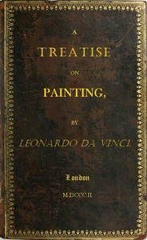

# A Treatise on Painting <kbd>46915</kbd>

## Authors

 - Leonardo, da Vinci <small>(1452 - 1519)</small>

## Subjects

 - Drawing -- Technique -- Early works to 1800
 - Leonardo, da Vinci, 1452-1519
 - Painting -- Technique -- Early works to 1800

## Download

 - https://www.gutenberg.org/files/46915/46915.zip
 - https://www.gutenberg.org/cache/epub/46915/pg46915.cover.small.jpg
 - https://www.gutenberg.org/files/46915/46915-h/46915-h.htm
 - https://www.gutenberg.org/files/46915/46915.txt
 - https://www.gutenberg.org/ebooks/46915.html.images
 - https://www.gutenberg.org/files/46915/46915-8.txt
 - https://www.gutenberg.org/ebooks/46915.epub.images
 - https://www.gutenberg.org/ebooks/46915.rdf
 - https://www.gutenberg.org/ebooks/46915.kindle.images
 - https://www.gutenberg.org/ebooks/46915.txt.utf-8

## Book Shelves

