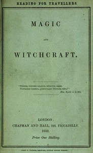

# Magic and Witchcraft <kbd>42550</kbd>

## Authors

 - Moir, George <small>(1800 - 1870)</small>

## Subjects

 - Magic -- History
 - Witchcraft -- History

## Download

 - https://www.gutenberg.org/files/42550/42550.txt
 - https://www.gutenberg.org/files/42550/42550-8.zip
 - https://www.gutenberg.org/files/42550/42550-h.zip
 - https://www.gutenberg.org/cache/epub/42550/pg42550.cover.small.jpg
 - https://www.gutenberg.org/ebooks/42550.html.images
 - https://www.gutenberg.org/ebooks/42550.rdf
 - https://www.gutenberg.org/ebooks/42550.kindle.images
 - https://www.gutenberg.org/ebooks/42550.txt.utf-8
 - https://www.gutenberg.org/ebooks/42550.epub.images

## Book Shelves

