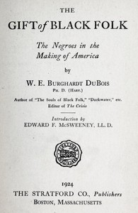

# The Gift of Black Folk: The Negroes in the Making of America <kbd>66398</kbd>

## Authors

 - Du Bois, W. E. B. (William Edward Burghardt) <small>(1868 - 1963)</small>

## Subjects

 - African Americans -- History
 - United States -- Race relations

## Download

 - https://www.gutenberg.org/files/66398/66398-h.zip
 - https://www.gutenberg.org/files/66398/66398-0.zip
 - https://www.gutenberg.org/ebooks/66398.html.images
 - https://www.gutenberg.org/cache/epub/66398/pg66398.cover.small.jpg
 - https://www.gutenberg.org/ebooks/66398.rdf
 - https://www.gutenberg.org/files/66398/66398-0.txt
 - https://www.gutenberg.org/ebooks/66398.epub.images
 - https://www.gutenberg.org/ebooks/66398.kindle.images
 - https://www.gutenberg.org/ebooks/66398.txt.utf-8

## Book Shelves

