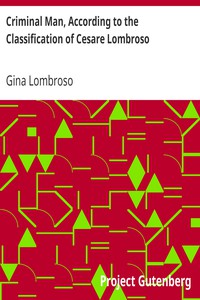

# Criminal Man, According to the Classification of Cesare Lombroso <kbd>29895</kbd>

## Authors

 - Lombroso, Gina <small>(1872 - 1944)</small>

## Subjects

 - Criminal anthropology
 - Criminology

## Download

 - https://www.gutenberg.org/cache/epub/29895/pg29895.cover.medium.jpg
 - https://www.gutenberg.org/files/29895/29895.zip
 - https://www.gutenberg.org/files/29895/29895-h/29895-h.htm
 - https://www.gutenberg.org/ebooks/29895.html.images
 - https://www.gutenberg.org/files/29895/29895.txt
 - https://www.gutenberg.org/files/29895/29895-8.txt
 - https://www.gutenberg.org/ebooks/29895.txt.utf-8
 - https://www.gutenberg.org/ebooks/29895.epub.images
 - https://www.gutenberg.org/ebooks/29895.rdf
 - https://www.gutenberg.org/ebooks/29895.kindle.images

## Book Shelves

