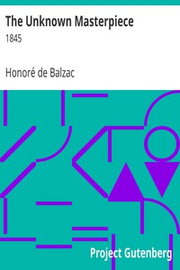

# The Unknown Masterpiece: 1845 <kbd>23060</kbd>

## Authors

 - Balzac, Honoré de <small>(1799 - 1850)</small>

## Subjects

 - Biographical fiction
 - France -- Fiction
 - French fiction -- Translations into English
 - Painters -- Fiction
 - Poussin, Nicolas, 1594?-1665 -- Fiction

## Download

 - https://www.gutenberg.org/files/23060/23060-8.txt
 - https://www.gutenberg.org/files/23060/23060.zip
 - https://www.gutenberg.org/files/23060/23060-h.zip
 - https://www.gutenberg.org/cache/epub/23060/pg23060.cover.small.jpg
 - https://www.gutenberg.org/files/23060/23060-h/23060-h.htm
 - https://www.gutenberg.org/files/23060/23060-0.txt
 - https://www.gutenberg.org/ebooks/23060.html.images
 - https://www.gutenberg.org/ebooks/23060.epub.images
 - https://www.gutenberg.org/ebooks/23060.rdf
 - https://www.gutenberg.org/ebooks/23060.kindle.images

## Book Shelves

