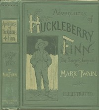

# Adventures of Huckleberry Finn <kbd>76</kbd>

## Authors

 - Twain, Mark <small>(1835 - 1910)</small>

## Subjects

 - Adventure stories
 - Bildungsromans
 - Boys -- Fiction
 - Finn, Huckleberry (Fictitious character) -- Fiction
 - Fugitive slaves -- Fiction
 - Humorous stories
 - Male friendship -- Fiction
 - Mississippi River -- Fiction
 - Missouri -- Fiction
 - Race relations -- Fiction
 - Runaway children -- Fiction

## Download

 - https://www.gutenberg.org/cache/epub/76/pg76.cover.medium.jpg
 - https://www.gutenberg.org/files/76/76-h.zip
 - https://www.gutenberg.org/files/76/76-0.zip
 - https://www.gutenberg.org/ebooks/76.html.images
 - https://www.gutenberg.org/ebooks/76.kindle.images
 - https://www.gutenberg.org/ebooks/76.rdf
 - https://www.gutenberg.org/ebooks/76.epub.images

## Book Shelves

 - Banned Books List from the American Library Association
 - Banned Books from Anne Haight's list
 - Best Books Ever Listings
