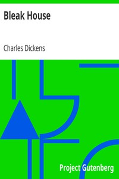

# Bleak House <kbd>1023</kbd>

## Authors

 - Dickens, Charles <small>(1812 - 1870)</small>

## Subjects

 - Bildungsromans
 - Domestic fiction
 - Guardian and ward -- Fiction
 - Illegitimate children -- Fiction
 - Inheritance and succession -- Fiction
 - Legal stories
 - London (England) -- Fiction
 - Young women -- Fiction

## Download

 - https://www.gutenberg.org/files/1023/1023-h/1023-h.htm
 - https://www.gutenberg.org/files/1023/1023.zip
 - https://www.gutenberg.org/ebooks/1023.html.images
 - https://www.gutenberg.org/files/1023/1023.txt
 - https://www.gutenberg.org/cache/epub/1023/pg1023.cover.small.jpg
 - https://www.gutenberg.org/ebooks/1023.rdf
 - https://www.gutenberg.org/ebooks/1023.epub.images
 - https://www.gutenberg.org/ebooks/1023.kindle.images
 - https://www.gutenberg.org/ebooks/1023.txt.utf-8

## Book Shelves

