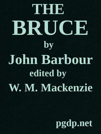

# The Bruce <kbd>44292</kbd>

## Authors

 - Barbour, John <small>(null - 1395)</small>

## Subjects

 - Robert I, King of Scots, 1274-1329 -- Poetry
 - Scotland -- History -- Robert I, 1306-1329 -- Poetry
 - Scotland -- Kings and rulers -- Poetry

## Download

 - https://www.gutenberg.org/files/44292/44292-h/44292-h.htm
 - https://www.gutenberg.org/files/44292/44292.zip
 - https://www.gutenberg.org/files/44292/44292-0.txt
 - https://www.gutenberg.org/files/44292/44292-8.zip
 - https://www.gutenberg.org/cache/epub/44292/pg44292.cover.small.jpg
 - https://www.gutenberg.org/files/44292/44292-8.txt
 - https://www.gutenberg.org/ebooks/44292.html.images
 - https://www.gutenberg.org/ebooks/44292.rdf
 - https://www.gutenberg.org/ebooks/44292.kindle.images
 - https://www.gutenberg.org/ebooks/44292.epub.images

## Book Shelves

