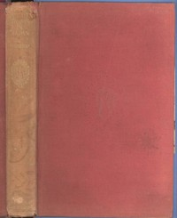

# Unbeaten Tracks in Japan <kbd>2184</kbd>

## Authors

 - Bird, Isabella L. (Isabella Lucy) <small>(1831 - 1904)</small>

## Subjects

 - Bird, Isabella L. (Isabella Lucy), 1831-1904 -- Travel -- Japan
 - Japan -- Description and travel

## Download

 - https://www.gutenberg.org/cache/epub/2184/pg2184.cover.small.jpg
 - https://www.gutenberg.org/ebooks/2184.html.images
 - https://www.gutenberg.org/files/2184/2184-0.txt
 - https://www.gutenberg.org/ebooks/2184.rdf
 - https://www.gutenberg.org/ebooks/2184.epub.images
 - https://www.gutenberg.org/ebooks/2184.kindle.images

## Book Shelves

