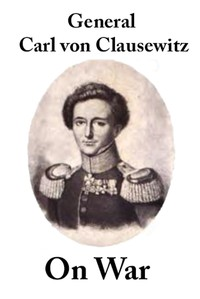

# On War <kbd>1946</kbd>

## Authors

 - Clausewitz, Carl von <small>(1780 - 1831)</small>

## Subjects

 - Military art and science
 - War

## Download

 - https://www.gutenberg.org/files/1946/1946.txt
 - https://www.gutenberg.org/files/1946/1946-8.zip
 - https://www.gutenberg.org/files/1946/1946-h.zip
 - https://www.gutenberg.org/cache/epub/1946/pg1946.cover.small.jpg
 - https://www.gutenberg.org/files/1946/1946-h/1946-h.htm
 - https://www.gutenberg.org/ebooks/1946.html.images
 - https://www.gutenberg.org/files/1946/1946-0.txt
 - https://www.gutenberg.org/ebooks/1946.rdf
 - https://www.gutenberg.org/ebooks/1946.epub.images
 - https://www.gutenberg.org/ebooks/1946.kindle.images

## Book Shelves

