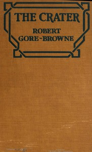

# The Crater <kbd>67694</kbd>

## Authors

 - Gore Browne, Robert <small>(null - null)</small>

## Subjects

 - British -- Africa -- Fiction
 - Storytelling -- Fiction
 - Tanganyika, Lake -- Fiction
 - Triangles (Interpersonal relations) -- Fiction

## Download

 - https://www.gutenberg.org/ebooks/67694.txt.utf-8
 - https://www.gutenberg.org/ebooks/67694.epub.images
 - https://www.gutenberg.org/ebooks/67694.kindle.images
 - https://www.gutenberg.org/ebooks/67694.rdf
 - https://www.gutenberg.org/cache/epub/67694/pg67694.cover.small.jpg
 - https://www.gutenberg.org/files/67694/67694-0.txt
 - https://www.gutenberg.org/files/67694/67694-h/67694-h.htm
 - https://www.gutenberg.org/files/67694/67694-0.zip

## Book Shelves

