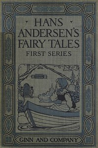

# Hans Andersen's Fairy Tales. First Series <kbd>32571</kbd>

## Authors

 - Andersen, H. C. (Hans Christian) <small>(1805 - 1875)</small>

## Subjects

 - Children's stories, Danish -- Translations into English
 - Fairy tales
 - Fairy tales -- Denmark

## Download

 - https://www.gutenberg.org/files/32571/32571-8.zip
 - https://www.gutenberg.org/files/32571/32571-h/32571-h.htm
 - https://www.gutenberg.org/cache/epub/32571/pg32571.cover.medium.jpg
 - https://www.gutenberg.org/files/32571/32571-0.txt
 - https://www.gutenberg.org/ebooks/32571.html.images
 - https://www.gutenberg.org/files/32571/32571-8.txt
 - https://www.gutenberg.org/files/32571/32571.txt
 - https://www.gutenberg.org/ebooks/32571.kindle.images
 - https://www.gutenberg.org/ebooks/32571.epub.images
 - https://www.gutenberg.org/ebooks/32571.rdf

## Book Shelves

